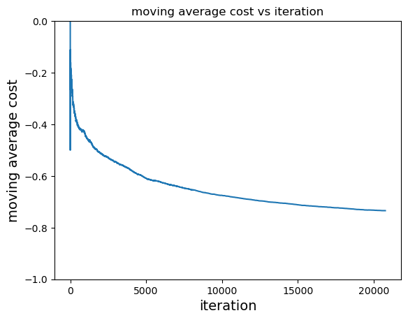

# Contextual bandits exploration #

## Purpose
We tested different contextual bandits approaches on two different datasets and learning settings. The goal was to experiment with different bandits settings and gain confidence with bandits using test environments. Our first test with a simulation of an online learning setting using a multi-class prediction dataset mimics a scenario with no historical data. Accordingly, we performed less experimentation with exploration settings. The second test was on a offline setting with a historical bandits dataset. Testing on both online and offline settings allowed us to gain experience in two common contextual bandits use cases. 

# Online setting: Multi-class prediction of obesity risk
## Summary ##
Contextual bandits model applied on obesity risk dataset. The original dataset was transformed via preprocessing and feature engineering according to an EDA. A simulator was then created from the dataset to mimic an online learning setting. Lastly, the contextual bandits model was run on the simulator. The final average regret was 0.265.

## Data ##
The original problem of the dataset was to predict a person's `NObeyesdad` (a measure similar to BMI) based on a set of 17 related features. `NObeyesdad` has 7 classes, ranging from `insufficient_weight` to `overweight_level_II` similar to BMI classifications. Some of the given features are simpler like gender, weight, age. Others are more complicated. For example, `FCVC` is frequency of consumption of vegetables, `NCP` is number of main meals, and `FAF` is physical activity frequency.

## EDA ##
Distributions of the data were plotted. We found that the dataset with respect to `NObeyesdad` is roughly balanced. 

<center></center>

## Preprocessing ##
Our EDA showed us that there are no N.A. values to deal with, but there are features with string values that need to be handled. Accordingly, `NObeyesdad` labels and string features were converted to numerical features with `sklearn.preprocessing.LabelEncoder` and `sklearn.preprocessing.OrdinalEncoder` respectively.

### Feature Engineering ###
Some features were constructed as combinations of the original ones.
```
X["BMI"] = X["Weight"]/X["Height"]**2>
X["BMI_group"] = group_series(X["BMI"], [18.5, 25, 30, 35, 40])
X["FAVC-FCVC"] = X["FAVC"] - X["FCVC"]
X["BMI*FAF"] = X["BMI"] * X["FAF"]
X["FAF-TUE"] = X["FAF"] - X["TUE"]
X["FCVC*NCP"] = X["FCVC"] * X["NCP"]
X["BMI/NCP"] = X["BMI"]/X["NCP"]
X["Age_group"] = group_series(X["Age"], [10, 20, 30, 40, 50, 60, 70])
```
Notably, `BMI_group` is closely related to `NObeyesdad` which helped decrease average regret by a significant amount. Without BMI statistics but including other engineered features, the average regret was 0.339. 

After feature engineering, correlations of features were then calculated. The only pair of features with > 0.95 correlation was `BMI` and `BMI_group` (0.983). Based on this, `BMI` feature was removed.

### Scaling ###
Scaling was not used due to potential data leakage. It might be worth noting that scaling significantly decreases regret. Using `sklearn.preprocessing.RobustScaler`, the final average regret was 0.188.

## Model ##
The contextual bandits model was created with `Vowpal Wabbit` `--cb_explore`. A useful addition was to set the model to `--first 100`, which tells the model to explore (select each action with uniform probability) for the first 100 steps. Afterwards, the model will exploit (greedy) for the rest of the steps. This helped prevent premature optimization that greatly increased regret. Furthermore, more complicated exploration strategies seemed to harm the model since they promote unnecessary exploration even though `BMI_group` and `weight` seem to be naively well associated with `NObeyesdad`.

In more complex environments (more actions or features), it will likely be preferable to use a more advanced exploration strategy like Open Cover. For example, it is shown that Open Cover outperforms `first` in the test dataset used in the original paper [[1]](#1). This idea is further expanded upon in Flaws and Further Improvements.

## Simulator ##
It was difficult for us to find a contextual bandits environment readily available, so we chose to convert a classification task to one instead. Each `NObeyesdad` class becomes an arm (7 total arms). The simulator converts the features of each datapoint into a context. The `NObeyesdad` class associated with the features becomes the correct arm to pull. 

Our simulator performs a loop through all the datapoints in the dataset. For each datapoint, it gives the features of the datapoint as the context to the contextual bandits model. The contextual bandits model in turn gives a probability distribution of actions. An action is sampled from the distribution. The cost of the action is then calculated, with -1 signifying that the action was the correct arm (correct `NObeyesdad` class) and 0 otherwise. Finally, the model learns from the result.

## Result ##
The model was run on all of the training data. Costs were recorded at each step of the simulator and the moving average of the costs was calculated (plotted below).
<center> </center>
We see that the model learns quickly based on the steepeness of the first few thousand iterations. The curve is quite stable (low volatility), so it seems that the model is quite consistent. 

We calculated the average regret since it is a representative measure of the performance of the model on the dataset. The final average regret was `1 - (-average_cost) = 0.265`. The final accuracy of the model was 0.847. On the test set, the model had 0.802 accuracy on private. For reference, the winning Kaggle had 0.911 accuracy. In our opinion, this is good performance considering the constraints imposed by online learning.

## Flaws and Future Improvements ##
The dataset we used is not a typical use case of contextual bandits. It will be good to explore performance on something like a recommender dataset. These types of datasets also have reward stochasticity, which this dataset/simulator does not have. 

Another area to look at is environments with larger features spaces and bigger action spaces. Exploration mode `first` performed the best on the simulator of the few tested, even though `Vowpal Wabbit` has much more complicated approaches. `Open Cover` is the most complex model in the library (stated by `Vowpal Wabbit`). It learns `n` policies and achieved 0.331 regret with 1. This could be due to the simplicity of the dataset, which favored models that are quicker to exploit like `first`. It is also interesting to note that as we increased the complexity of `Open Cover` by increasing the number of covers, model performance degraded. This reflects the results of the original authors [[1]](#1). It will be interesting to test when more complex models, especially `Open Cover` with higher number of policies, works well.

For large action space (LAS) enviornments, `Vowpal Wabbit` provides a LAS algorithm which eliminates similar actions to allow for better exploration. This is a possible future direction to explore as well.

## Generalization ##
This analysis will likely generalize well to environments where some features are highly associated with target actions. In harder environments, the bandits model will likely have worse regret (with the same amount of iterations) and more complex exploration strategies will need to be used (as discussed previously). In general, we have confidence that we would be able to create a bandits model that works well on a new environment, although it may take more work experimenting with exploration strategies.

# Offline setting: Open bandit dataset #

## Summary ##
Contextual bandits was applied on an offline bandits dataset. The trained policy was evaluated with progressive validation. The average cost of the original policy was 0.995 while our trained policy's estimated average loss was 0.691 and 0.941 calculated using IPS and DR respectively.

## Data ##
Open bandit dataset was collected by ZOZO (Japanese fashion e-commerce company) over 7-days in 2019. The company uses MAB algorithms to recommend clothing to items on their website. Two policies were used during the data collection: Bernoulli Thompson Sampling and pure random. An item would be recommended by one of the two policies and whether or not it was clicked was recorded. Furthermore, user data and other relevant information was recorded (to use as feature for contextual bandits). ZOZO also provides 4 additional features for each item.

The data is split by policy and also by item category: all, men's, and women's. We focused on Bernoulli Thompson Sampling and all items. Bernoulli Thompson Sampling was chosen because it had better ctr (click-through rate) (0.50% vs 0.35%) than random, so it would provide better quality data. All was chosen as it seems to be a more complex environment since it has a larger action space. This subset of data features 80 possible items to recommend (80 actions) and 12,168,084 samples. In consideration of compute time, only the last 1,168,084 were used, with the hope that the original policy would perform better after the first 11,000,000 samples.

## Model ##
The bandits model used was `Vowpal Wabbit` `cb_adf`. Adf (action dependent features) supports rich action features, which was why it was chosen. IPS (inverse propensity sampling), DR (doubly robust), and MTR (multi-task regression) estimators were all chosen as estimators. IPS and DR are both unbiased estimators of reward. Furthermore, DR is an extension of IPS in combination with regression and has lower variance than IPS. As a result, the loss calculated by progressive validation with DR is likely more accurate than with IPS.

## Preprocessing ##
We used `sklearn.preprocessing.OrdinalEncoder` to convert categorical features into numerical ones. Additionally, the original dataset reported 1 if an item was clicked and 0 otherwise. We changed this to a cost structure by inverting it: 0 if an item was clicked and 1 otherwise.

## Training ##
The model was trained with one pass on the subsampled dataset. The dataset was iterated over and each sample was converted to `Vowpal Wabbit` adf format and fed into the model. 

## Off Policy Evaluation ##
Off policy evaluation was done with `Vowpal Wabbit`'s progressive validation. `Vowpal Wabbit` uses the chosen model estimator to calculate an estimated reward for actions predicted by the model. As stated in the summary, the average loss was 0.691 and 0.941 for IPS and DR respectively. DR is probably a more accurate measure. In comparison, we calculated the average cost of the our subset of the dataset to be 0.995. 

Both estimated losses were lower than the original policy, so we would expect both IPS and DR models to perform better if they were used instead.

## Flaws and Further Improvements ##
Utilizing the full dataset will probably allow us to obtain a better estimate of performance of our model on the dataset. The entire dataset has low ctr and hence, sparse reward. The subset we used has of course even less instances of reward. 

It will also be interesting to see if there are any algorithms that handle sparse reward better and if the LAS algorithm mentioned in the first section could be used.

## References
<a id="1">[1]</a> 
Agarwal, A., Hsu, D., Kale, S., Langford, J., Li, L. &amp; Schapire, R.. (2014). Taming the Monster: A Fast and Simple Algorithm for Contextual Bandits. <i>Proceedings of the 31st International Conference on Machine Learning</i>, in <i>Proceedings of Machine Learning Research</i> 32(2):1638-1646 Available from https://proceedings.mlr.press/v32/agarwalb14.html.

