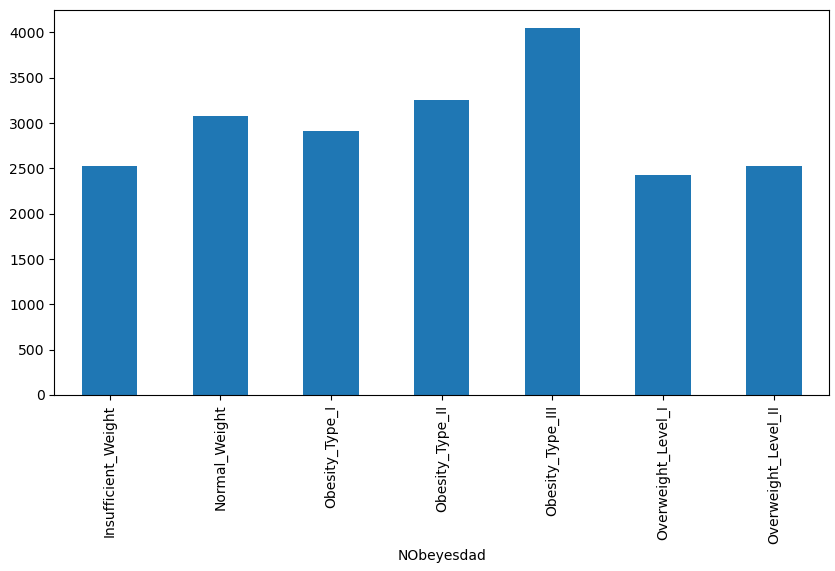
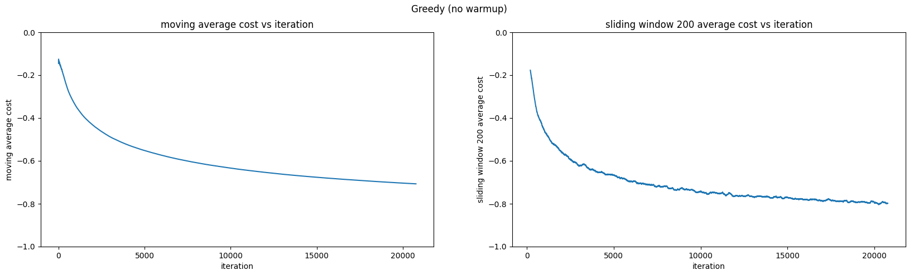
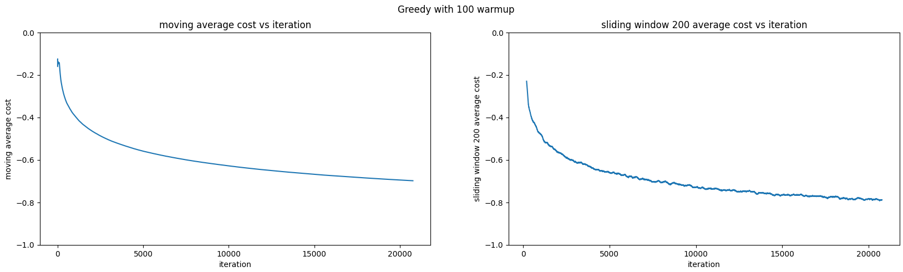
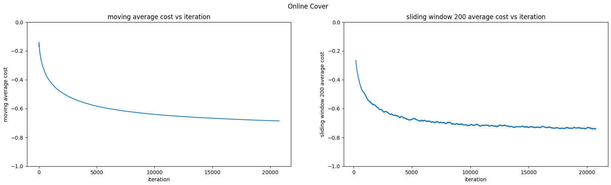
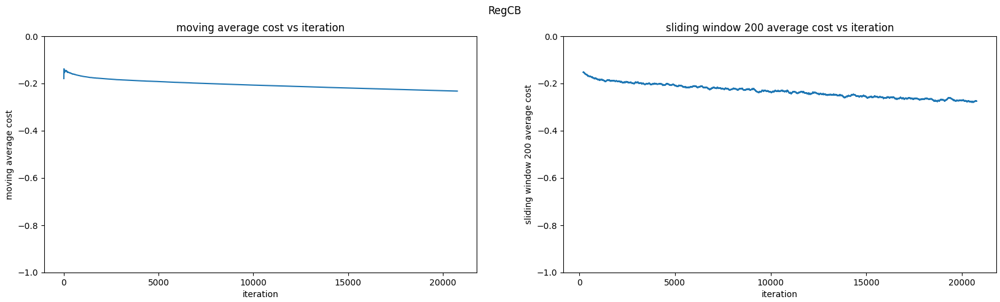

# Contextual bandits exploration
## Table of Contents
1. [Summary](#contextual-bandits-exploration)
    1. [Context](#context)
    2. [Purpose](#purpose)
    3. [Summary of results](#summary-of-results)
2. [Simulated online setting: Multi-class prediction of obesity risk](#simulated-online-setting-multi-class-prediction-of-obesity-risk)
    1. [Summary](#summary)
    2. [Data](#data)
    3. [EDA](#eda)
    4. [Preprocessing](#preprocessing)
    5. [Simulator](#simulator)
    6. [Models tested](#models-tested)
    7. [Online learning](#online-learning)
    8. [Estimators](#estimators)
    9. [Models](#models)
    10. [Results](#results)
    11. [Notes](#notes)
3. [Offline setting: Open bandit dataset](#offline-setting-open-bandit-dataset)
    1. [Summary](#summary-1)
    2. [Data](#data-1)
    3. [Model](#model)
    4. [Preprocessing](#preprocessing-1)
    5. [Training](#training)
    6. [Off policy evaluation](#off-policy-evaluation)
    7. [Flaws and further improvements](#flaws-and-further-improvements)
4. [References](#references)

## Context
Multi-armed bandits (MAB) is a problem where we try to find the best action from a set of a few. In particular, a policy iteratively chooses an action and receives the cost of that action. The model works to minimize the total cost of the actions it chooses.

Contextual bandits is an extension of MAB where the policy receives a context (a set of features) before it takes an action. For example, if we're recommending products, a contextual bandits model might be given some features of a user like age and gender and recommend a product based on this.

In this analysis, we explore two common bandits settings: online and offline. Online bandits is when we deploy the model and it is taking actions and receiving feedback. Offline bandits is when we're testing the performance of a new model compared to an older model. Here, we have access to a logged dataset of the actions of the older model. We can use the dataset to train the new model and estimate its performance in comparison to the new model.

## Purpose
In this analysis, we tested contextual bandits on two different datasets and learning settings to gain confidence in using bandits through test environments. Our first test was a simulation of an online learning setting using a multi-class prediction dataset, mimicking a scenario with no historical data. The second was an offline scenario where we have access to the actions of a past bandits dataset. Testing both approaches allowed us to gain experience in two common contextual bandits use cases.

## Summary of results
In our simulated online setting, we correctly predicted 70.7% of actions correctly. We can compare this to a multi-armed bandits (MAB) model, another popular approach to online learning. A perfect MAB model would only correctly predict 15.6% of actions, so our model significantly improves this by about 5x. Our model also learns quickly, which is crucial for real world scenarios where faster convergence means we get better results. For example, a model that learns how to recommend products faster leads to more users seeing products that they want (and conversely less users seeing products that they don't).

In the offline setting, we obtain an estimated 4.9% to 30.9% click-through rate on a product recommendation dataset, depending on the estimator used. In comparison, the original dataset used a MAB model that only achieved 0.5%. Using the theoretically more reliable estimate of 4.9%, this is an almost 10x the amount of clicks, a substantial improvement.

# Simulated online setting: Multi-class prediction of obesity risk
A supervised learning classification problem can be converted into an online learning problem by creating a simulator. Since we know the correct class associated with a set of features, we can make the features the context and the correct class the correct action. If the bandits model predicts the right action, then we give it -1 cost. Otherwise, if it's wrong, we give it 0 cost (other cost structures work too, as long as we're minimizing cost). We go through the dataset sample by sample as in an actual online setting and the simulator tells the model the costs of its actions. See the Simulator section for more information on how we built one for this dataset.

## Summary
We applied a contextual bandits model by simulating a multi-class prediction obesity risk dataset. The original dataset was transformed via preprocessing and feature engineering according to an exploratory data analysis (EDA). As explained above, a simulator was created from the dataset to mimic an online learning setting. Lastly, the contextual bandits model was run on the simulator and obtained a final average cost of -0.707.

## Data
The original problem of the dataset was to predict a person's `NObeyesdad` (a measure similar to BMI) based on a set of 17 related features. `NObeyesdad` has 7 classes, ranging from `insufficient_weight` to `overweight_level_II` similar to BMI classifications. Some of the given features are simpler like gender, weight, age. Others are more complicated. For example, `FCVC` is frequency of consumption of vegetables, `NCP` is number of main meals, and `FAF` is physical activity frequency.

## EDA
Distributions of the data were plotted. We found that the dataset with respect to `NObeyesdad` is roughly balanced. 

<center></center>

## Preprocessing
Our EDA showed us that there are no N.A. values to deal with, but there are features with string values that need to be handled. Accordingly, `NObeyesdad` labels and string features were converted to numerical features with `sklearn.preprocessing.LabelEncoder` and `sklearn.preprocessing.OrdinalEncoder` respectively.

### Feature engineering
Some features were constructed as combinations of the original ones.
```
X["BMI"] = X["Weight"]/X["Height"]**2>
X["BMI_group"] = group_series(X["BMI"], [18.5, 25, 30, 35, 40])
X["FAVC-FCVC"] = X["FAVC"] - X["FCVC"]
X["BMI*FAF"] = X["BMI"] * X["FAF"]
X["FAF-TUE"] = X["FAF"] - X["TUE"]
X["FCVC*NCP"] = X["FCVC"] * X["NCP"]
X["BMI/NCP"] = X["BMI"]/X["NCP"]
X["Age_group"] = group_series(X["Age"], [10, 20, 30, 40, 50, 60, 70])
```
Notably, `BMI_group` is closely related to `NObeyesdad` which helped decrease average regret by a significant amount. Without BMI statistics but including other engineered features, the average regret was 0.339. 

After feature engineering, correlations of features were then calculated. The only pair of features with > 0.95 correlation was `BMI` and `BMI_group` (0.983). Based on this, `BMI` feature was removed.

### Scaling
Scaling was not used due to potential data leakage. It might be worth noting that scaling significantly decreases regret. Using `sklearn.preprocessing.RobustScaler`, the final average regret was 0.188.

## Simulator
It was difficult for us to find a contextual bandits environment readily available, so we chose to convert a classification task to one instead. Each `NObeyesdad` class becomes an arm (7 total arms). The simulator converts the features of each datapoint into a context. The `NObeyesdad` class associated with the features becomes the correct arm to pull. 

Our simulator performs a loop through all the data points in the dataset. For each datapoint, it gives the features of the datapoint as the context to the contextual bandits model. The contextual bandits model in turn gives a probability distribution of actions. An action is sampled from the distribution as the predicted action of the model. The cost of the action is then calculated. Finally, the model learns from the result.

## Models tested
We tested `Vowpal Wabbit`'s Greedy, RegCB, and Cover models to get a better sense of when certain exploration settings perform better. According to Bietti et al. we expected Greedy and RegCB to perform the best because we believe that this dataset is "easy" in the sense that `BMI_group` is likely well correlated with `NOBeyesdad` [[1]](#1). Bietti et al. show that Greedy performs well on easy datasets while RegCB performs well in general. Intuitively, this is because more robust models like Cover, which actively encourage exploration, explore too much for easy datasets. Natural exploration from the model simply trying actions is enough. The Results section shows that Greedy performs the best but RegCB surprisingly does the worst.

Specifically, we tested Greedy with no warmup, Greedy with 100 iterations of warmup, optimizing variant of RegCB with 1e-3 mellowness, and Cover with no-uniform exploration with 4 learners and 0.1 psi. These are optimal hyperparameters found by Bietti et al.. Since we focus on these specific versions of the models, we refer to optimizing RegCB as RegCB and no-uniform Cover as Cover for the rest of the analysis.

The following is a brief description of the models used. We first talk about online learning and estimators, since they're used by the algorithms.

## Online learning
For contextual bandits, we get a context and the cost of the action we choose at that timestep. We could use these contexts and costs to build a dataset and train a supervised learning model to learn the best action based on context. However, building a new dataset and retraining a model at each timestep can be expensive, especially if we have many timesteps. Instead, we could use an online learning model which can sequentially learn from each context and cost each timestep without having to entirely retrain. 

For a model that uses an online learner, we do the following each timestep. Since we don't necessarily know the best action given a context (we only know the costs of the actions we take given context), the online learner instead predicts the cost of an action on a context. Specifically, if we have online learner $f$ and get context $x_t$, take action $a_t$, and receive cost $c_t$ at timestep $t$, we minimize MSE
 $$\sum_{t=1} (f(x_t, a_t) - c_t)^2.$$ 
The action the policy chooses to explore with is the one that minimizes the cost given the timestep's context. From now on, we say that the learner "chooses" an action $a$ if $a$ minimizes the cost.

A linear online learner is used for all the models. The difference is how they handle exploration to train the online learner and exploitation.

## Estimators
A cost estimator estimates the cost of an action. This might be useful because:
1. At each timestep, we only get the cost of the action we take, but it would be preferable to get the cost of all actions to have more data for our online learner. Although we can't get the actual costs, we could instead estimate their costs using an estimator. 
2. To explore more effectively, rather than always choosing the action the model believes is best, we might want to randomly choose an action instead. This motivates a model returning a distribution over actions to sample from. That is, we get a set of probabilities each corresponding to an action. Each probability could be interpreted as how confident we are in its corresponding action. This introduces sampling bias, since we choose actions that the model likes with higher probability. We can use an unbiased cost estimator like IPS and DR to fix this.

In this analysis, we use inverse propensity sampling (IPS) and doubly robust (DR) for Cover and importance weighted regression (IWR) for Greedy. 

For IPS and DR, instead of using the raw cost of our chosen action at each timestep, we estimate a cost $\hat c_t(a)$ for each action and use each as a separate datapoint to train the online learner.

### IPS
For timestep $t$, suppose we take action $a_t$ with probability $p_t$ and receive cost $c_t$. IPS's loss estimate for action $a$ for timestep $t$ would be
    $$ \hat c_t(a) = \frac{c_t}{p_t} 𝟙\{a = a_t\}. $$
Note that $\ell_t(a) = 0$ if $a \neq a_t$. It's important to note that IPS is provably unbiased. However, IPS can have high variance since $p_t$ can be small [[1]](#1).

### DR
DR is an extension of IPS with supervised learning to fix IPS's variance problem. This is why DR could be preferred over IPS and why Bietti et al. generally find better performance with DR over IPS. DR trains another online learner $\hat \ell_t$ which predicts the cost of an action given context. DR's estimate for action $a$ at timestep $t$ is
    $$ \hat c_t(a) = \frac{c_t - \hat \ell(x_t, a_t)}{p_t} 𝟙\{a = a_t\} + \hat \ell(x_t, a). $$
When $\hat \ell(x_t, a_t)$ is close to $c_t$, $c_t - \hat \ell(x_t, a_t)$ is small, helping to reduce variance [[1]](#1). Note that $\hat \ell_t$ is essentially the online learner we talked about before without loss estimation. Additionally, it is possible that $\hat c_t(a) \neq 0$ for $a \neq a_t$ unlike IPS. As with IPS, DR is an unbiased estimator of cost [[1]](#1).

### IWR
Unlike IPS and DR, IWR directly modifies the objective function of the online learner. We reweight the squared error in MSE instead of the cost. The new objective function becomes
    $$ \sum_{t=1}\frac 1 {p_t}(f(x_t, a_t) - c_t)^2. $$
IWR is not necessarily unbiased (it is unbiased if $p_t$ has full support but this is often not the case) [[1]](#1). 

### Estimator comparison
In general, we will probably see DR > IPS > IWR in terms of performance. IPS is better than IWR since it is unbiased. DR is better than IPS since it's also unbiased but has lower variance. As we stated earlier, Bietti et al. experimentally show that DR often performs better than IPS. However, they also show that the best performing can be dataset/model dependent. Furthermore, IWR has advantages in being more computationally efficient, since IPS and DR both update the online learner with the costs of all actions each timestep [[1]](#1).

## Models
### Greedy
Greedy is a direct implementation of the online learner $f$ we described before. At each timestep, we always exploit by selecting the action that $f$ chooses. We then optimize $f$ using IWR as the cost estimator [[1]](#1).

Greedy fails in certain (pathological) cases. Adding a starting warmup phase where we take each action with uniform probability can help fix this issue. After warmup, the model goes full greedy as usual. 

### Cover
In Cover we train $n$ online learners concurrently. At each timestep, the probability of action $a$ is proportional to the number of learners that choose $a$. The first policy we train by obtaining a cost estimate with IPS and DR and doing an online update. For the rest of the policies, Cover creates a decaying (with timestep) reward bonus for $\hat c(a)$ that decreases with the number of learners that choose $a$. This is meant to promote exploration by having learners predict a lower cost for less seen actions [[1]](#1).

Interestingly, Cover with $n = 1$ is Greedy with IPS or DR estimator.

### RegCB
RegCB estimates a confidence interval of the cost of each action at a timestep. It then chooses the action that has the least lower bound. The online learner is updated with the raw cost with no estimator.

The lower bound $l_t$ is found by considering the minimizing estimator in a set of "good" estimators from the hypothesis class $\mathcal F$. Specifically, the lower bound is defined as
    $$ l_t(a) = \min_{f \in \mathcal F_t} f(x_t, a) $$
where
    $$ \mathcal F_t = \{f \in \mathcal F: \hat R_{t-1}(f) - \min_{f \in\mathcal F} \hat R_{t-1}(f) \leq \Delta_t\} $$
and 
    $$ \hat R_{t}(f) = \frac{1}{t} \sum^t_{i=1}(f(x_i, a_i) - \ell_i(a_i))^2. $$
$\Delta_t$ is set to $C_0 \log(Kt)$ where $K$ is the number of actions and $C_0$ is a hyperparameter [[1]](#1). $F_t$ is a set of good estimators in the sense that members are at most $\Delta_t$ away from the best estimator. Calculating $l_t$ this way is practically infeasible. Instead, RegCB uses a series of approximations that Bietti et al. go over.  

### Model comparison
In a way, Greedy and RegCB both always exploit while Cover has explicit exploration mechanisms. As we stated before, the effectiveness of models can depend on the difficulty of the dataset, which can decide how much exploration is necessary.

## Results
We ran each model 100 times to account for stochasticity and averaged the costs of each iteration. We then plotted a moving average of costs for each model. To see how each model's accuracy improves over time, we also plotted a sliding window moving average. 





All the models except RegCB learn quite quickly.

We use final average cost as our judge of model performance, since it captures how each model balances exploration and exploitation. For this dataset, final average cost is simply the negative of the proportion of actions predicted correctly. Final average costs were -0.707, -0.698, -0.686, -0.232 for Greedy, Greedy with warmup, Cover, and RegCB respectively. Greedy performs the best as expected and the difference between warmup and no warmup is small. Interestingly, RegCB does very poorly in this dataset. This could be due to the dataset not meeting RegCB's assumptions [[1]](#1). 

We can compare our results to an ideal MAB model that knows the best action (`Obesity_Type_II`) from the start. This would only achieve -0.156 cost (proportion of `Obesity_Type_II` to entire dataset), making Greedy almost 5x better. This is a significant increase and shows how important context can be.

The final training accuracy for Greedy was 0.847 and 0.802 accuracy on the private test set. For reference, the winning Kaggle had 0.911 accuracy. Considering the partial information disadvantage of bandits where our model has to explore and is unaware of the correct actions in instances where it predicts wrong, we believe the around 0.1 drop in performance is quite good.

## Notes
### Flaws
While our dataset provided good insights, it doesn't represent the typical use case of contextual bandits (since we use a diabetes dataset). In the future, it would be great to explore performance on something like a recommender dataset. These types of datasets also have reward stochasticity, which is absent from our simulator.

Another area to look at is large action space (LAS) environments which real environments sometimes have. As an example, the clothing recommendation dataset we use below has 80 different actions. It could be worth looking into `Vowpal Wabbit`'s LAS algorithm which eliminates similar actions to allow for better exploration.

### Generalization
A key question is how well our analysis will generalize to real scenarios. As we saw here, Greedy will likely work well in any easy setting (low feature dimension, low action dimension). However, harder environments will require better exploration strategies. In these cases, RegCB and Cover may work better.

### Evaluation
There's also the question of how best to evaluate the performance of a model. If we had multiple models that we're considering, how do we know which one is better?

One strategy would be to horserace competing models at the same time, as we did above with Greedy, RegCB, and Cover. 

If we had an old bandits model, we could instead record its actions and costs. Using off policy evaluation, we could estimate the performance of a new model and compare it to the old model. We go into more detail in the next section.

# Offline setting: Open bandit dataset 
In the offline setting, we have access to a history of actions, corresponding costs, and contexts obtained from another bandits policy. We can use the data to train a new policy by using an estimator to estimate the cost of the model's predicted action based on the history. Using a cost estimator (which we go over in the Estimators section in the online section), we can also create an estimate of the performance of our new policy had it been used in place of the old policy. This is useful since we can see how well our model might perform without actually deploying it.

## Summary
We trained a contextual bandits model on an offline bandits dataset. The trained policy was evaluated with progressive validation using two estimators, IPS and DR. The CTR of the original policy was 0.5% while our trained policy's estimated CTR was 4.9%, which is an exceptional 10x improvement.

## Data
Open bandit dataset is the largest offline bandits dataset. For context, it was collected by ZOZO (Japanese fashion e-commerce company) over 7-days in 2019. The company uses MAB algorithms to recommend clothing to items on their website. Two policies were used during the data collection: Bernoulli Thompson Sampling and pure random. An item would be recommended by one of the two policies and whether or not it was clicked was recorded. Furthermore, user data and other relevant information were recorded (to use as feature for contextual bandits). ZOZO also provides 4 additional features for each item.

The data is split by policy and also by item category: all, men's, and women's. We focused on Bernoulli Thompson Sampling and all items. Bernoulli Thompson Sampling was chosen because it had better CTR (click-through rate) (0.50% vs 0.35%) than random, so it would provide better quality data. All was chosen as it seems to be a more complex environment since it has a larger action space. This subset of data features 80 possible items to recommend (80 actions) and 12,168,084 samples. In consideration of compute time, only the last 1,168,084 were used, with the hope that the original policy would perform better after the first 11,000,000 samples.

## Model
The bandits model used was `Vowpal Wabbit` `cb_adf`. Adf (action dependent features) was chosen since it supports rich action features. IPS and DR were both tested. These are used over IWR since they're both unbiased. We expect DR to be a better estimate than IPS due to lower variance.

## Preprocessing
We used `sklearn.preprocessing.OrdinalEncoder` to convert categorical features into numerical ones. Additionally, the original dataset reported 1 if an item was clicked and 0 otherwise. We changed this to a cost structure by inverting it: 0 if an item was clicked and 1 otherwise.

## Training
The model was trained with one pass on the subsampled dataset. The dataset was iterated over and each sample was converted to `Vowpal Wabbit` adf format and fed into the model. 

## Off policy evaluation
Off policy evaluation was done with `Vowpal Wabbit`'s progressive validation. `Vowpal Wabbit` uses the chosen model estimator to calculate an estimated reward for actions predicted by the model. As stated in the summary, the average loss was 0.691 and 0.941 for IPS and DR respectively. In comparison, we calculated the average cost of our subset of the dataset to be 0.995. 

Here, total cost is the amount of people that do not click on the item recommended by the policy and the average cost is the proportion of people who do not click on the recommended item. The average losses are the predicted average costs of our models if our models were used instead of the Bernoulli Thompson Sampling policy during original data collection. 

CTR, the proportion of people who click on the recommended item, is `(1 - average_cost) * 100`. Therefore, the CTR of Bernoulli Thompson Sampling on our subset of the data is 0.5%. Accordingly, the predicted CTRs are 30.9% and 4.9% for IPS and DR respectively. Using DR's CTR, this is about 10x the amount of people clicking on the recommended item. Since both CTRs are higher, we would expect both IPS and DR models to perform better if they were used during the original data collection instead of Bernoulli Thompson Sampling.

## Flaws and further improvements
One thing that stood out for us was the large difference between IPS and DR. This could be due to the fact that our subset of data had few instances of reward. By utilizing the full dataset, we could probably get a better estimate of performance.

It'll also be interesting to see if there are any algorithms that handle sparse reward better and if the LAS algorithm mentioned in the first section could be used.

# References
<a id="1">[1]</a> 
Bietti, A., Agarwal, A., & Langford, J. (2021). A contextual bandit bake-off. Journal of Machine Learning Research, 22(133), 1-49.

<a id="2">[2]</a> 
Agarwal, A., Hsu, D., Kale, S., Langford, J., Li, L. &amp; Schapire, R.. (2014). Taming the Monster: A Fast and Simple Algorithm for Contextual Bandits. <i>Proceedings of the 31st International Conference on Machine Learning</i>, in <i>Proceedings of Machine Learning Research</i> 32(2):1638-1646 Available from https://proceedings.mlr.press/v32/agarwalb14.html.

