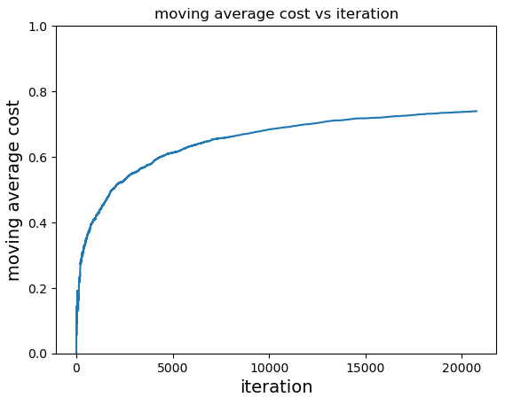

# Contextual bandits on multi-class prediction of obesity risk #

## Summary ##
Contextual bandits model applied on obesity risk dataset. The original dataset was transformed via preprocessing and feature engineering according to an EDA. A simulator was then created from the dataset to mimic an online learning setting. Lastly, the contextual bandits model was run on the simulator. The final average regret was 0.260.

## Data ##
The original problem of the dataset was to predict a person's `NObeyesdad` (a measure similar to BMI) based on a set of 17 related features. `NObeyesdad` has seven classes, ranging from `insufficient_weight` to `overweight_level_II` similar to BMI classifications. Some of the given features are simpler like gender, weight, age. Others are more complicated. For example, `FCVC` is frequency of consumption of vegetables, `NCP` is number of main meals, and `FAF` is number of physical activity frequency.

## EDA ##
Distributions of the data were plotted. We found that the dataset with respect to `NObeyesdad` is roughly balanced. 

<center></center>

## Preprocessing ##
Our EDA showed us that there are no N.A. values to deal with, but there are features with string values that need to be handled. Accordingly, `NObeyesdad` labels and string features were converted to numerical features with `sklearn.preprocessing.LabelEncoder` and `sklearn.preprocessing.OrdinalEncoder` respectively.

### Feature Engineering ###
Some features were constructed as combinations of the original ones.
```
X["BMI"] = X["Weight"]/X["Height"]**2>
X["BMI_group"] = group_series(X["BMI"], [18.5, 25, 30, 35, 40])
X["FAVC-FCVC"] = X["FAVC"] - X["FCVC"]
X["BMI*FAF"] = X["BMI"] * X["FAF"]
X["FAF-TUE"] = X["FAF"] - X["TUE"]
X["FCVC*NCP"] = X["FCVC"] * X["NCP"]
X["BMI/NCP"] = X["BMI"]/X["NCP"]
X["Age_group"] = group_series(X["Age"], [10, 20, 30, 40, 50, 60, 70])
```
Notably, `BMI_group` is closely related to `NObeyesdad` which helped decrease average regret by a significant amount. Without BMI statistics but including other engineered features, the average regret was 0.339. 

After feature engineering, correlations of features were then calculated. The only pair of features with > 0.95 correlation was `BMI` and `BMI_group` (0.983). Based on this, `BMI` feature was removed.

### Scaling ###
Scaling was not used due to potential data leakage. It might be worth noting that scaling significantly decreases regret. Using `sklearn.preprocessing.RobustScaler`, the final average regret was 0.188.

## Model ##
The contextual bandits model was created with `Vowpal Wabbit` `--cb_explore`. A useful addition was to set the model to explore (select each action with uniform probability) for the first 100 steps. This helped prevent premature optimization that greatly increased regret.

## Simulator ##
It was difficult for us to find a contextual bandits environment readily available, so we chose to convert a classification task to one instead. Given features `X` and labels `y`, the simulator would
1. shuffle `X` and `y`
2. feed the model a data point in `X` as the context
3. get the action of the model
4. calculate the cost and have the model learn from the cost given the action and context

The cost of an action was -1 if it was equal to the `NObeyesdad` label of the data point, and otherwise 0.

## Result ##
The model was run on all of the training data. Costs were recorded at each step of the simulator and the negative of the moving average of the costs was calculated (plotted below).
<center> </center>

The final average regret was calculated as `1 - (-average_cost) = 0.274`.