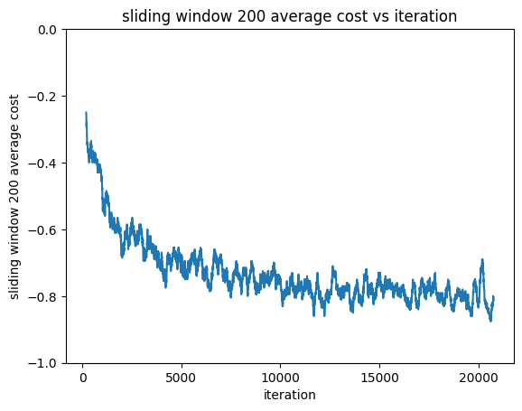

# Contextual bandits exploration
## Context
Multi-armed bandits (MAB) is a problem where we try to find the best action from a set of a few. In particular, a policy iteratively chooses an action and receives the cost of that action. The model works to minimize the total cost of the actions it chooses.

Contextual bandits is an extension of MAB where the policy receives a context (a set of features) before it takes an action. For example, if we're recommending products, a contextual bandits model might be given some features of a user like age and gender and recommend a product based on this.

In this analysis, we explore two common bandits settings: online and offline. Online bandits is when we deploy the model and it is taking actions and receiving feedback. Offline bandits is when we're testing the performance of a new model compared to an older model. Here, we have access to a logged dataset of the actions of the older model. We can use the dataset to train the new model and estimate its performance in comparison to the new model.

## Purpose
In this tested different contextual bandits approaches on two different datasets and learning settings to gain confidence in using bandits through test environments. Our first test was a simulation of an online learning setting using a multi-class prediction dataset, mimicking a scenario with no historical data. The second was an offline scenario where we have access to the actions of a past bandits dataset. Testing both approaches allowed us to gain experience in two common contextual bandits use cases.

## Summary of results
In our simulated online setting, we achieved an average cost of -0.765, which is the negative of the proportion of correctly predicted actions. We can compare this to a multi-armed bandits (MAB) model, another popular approach to online learning. A perfect MAB model would only achieve -0.156 average cost, so our model has around 5x the performance. Our model also learns quickly, which is crucial for real world scenarios where faster convergence means we get better results. For example, a model that learns how to recommend products faster leads to more users seeing products that they want (and conversely less users seeing products that they don't).

In the offline setting, we obtain an estimated 4.9% to 30.9% click-through rate on a product recommendation dataset, depending on the estimator used. In comparison, the original dataset used a MAB model that only achieved 0.5%. Using the theoretically more reliable estimate of 4.9%, this is an almost 10x the amount of clicks, a substantial improvement.

# Simulated online setting: Multi-class prediction of obesity risk
A supervised learning classification problem can be converted into an online learning problem by creating a simulator. Since we know the correct class associated with a set of features, we can make the features the context and the correct class the correct action. If the bandits model predicts the right action, then we give it -1 cost. Otherwise, if it's wrong, we give it 0 cost (other cost structures work too, as long as we're minimizing cost). We go through the dataset sample by sample as in an actual online setting and the simulator tells the model the costs of its actions. See the Simulator section for more information on how we built one for this dataset.

## Summary
We applied a contextual bandits model by simulating a multi-class prediction obesity risk dataset. The original dataset was transformed via preprocessing and feature engineering according to an EDA. As explained above, a simulator was created from the dataset to mimic an online learning setting. Lastly, the contextual bandits model was run on the simulator and obtained a final average ost of -0.765.

## Data
The original problem of the dataset was to predict a person's `NObeyesdad` (a measure similar to BMI) based on a set of 17 related features. `NObeyesdad` has 7 classes, ranging from `insufficient_weight` to `overweight_level_II` similar to BMI classifications. Some of the given features are simpler like gender, weight, age. Others are more complicated. For example, `FCVC` is frequency of consumption of vegetables, `NCP` is number of main meals, and `FAF` is physical activity frequency.

## EDA
Distributions of the data were plotted. We found that the dataset with respect to `NObeyesdad` is roughly balanced. 

<center></center>

## Preprocessing
Our EDA showed us that there are no N.A. values to deal with, but there are features with string values that need to be handled. Accordingly, `NObeyesdad` labels and string features were converted to numerical features with `sklearn.preprocessing.LabelEncoder` and `sklearn.preprocessing.OrdinalEncoder` respectively.

### Feature engineering
Some features were constructed as combinations of the original ones.
```
X["BMI"] = X["Weight"]/X["Height"]**2>
X["BMI_group"] = group_series(X["BMI"], [18.5, 25, 30, 35, 40])
X["FAVC-FCVC"] = X["FAVC"] - X["FCVC"]
X["BMI*FAF"] = X["BMI"] * X["FAF"]
X["FAF-TUE"] = X["FAF"] - X["TUE"]
X["FCVC*NCP"] = X["FCVC"] * X["NCP"]
X["BMI/NCP"] = X["BMI"]/X["NCP"]
X["Age_group"] = group_series(X["Age"], [10, 20, 30, 40, 50, 60, 70])
```
Notably, `BMI_group` is closely related to `NObeyesdad` which helped decrease average regret by a significant amount. Without BMI statistics but including other engineered features, the average regret was 0.339. 

After feature engineering, correlations of features were then calculated. The only pair of features with > 0.95 correlation was `BMI` and `BMI_group` (0.983). Based on this, `BMI` feature was removed.

### Scaling
Scaling was not used due to potential data leakage. It might be worth noting that scaling significantly decreases regret. Using `sklearn.preprocessing.RobustScaler`, the final average regret was 0.188.

## Models Tested
We tested a variety of `Vowpal Wabbit` models to get a better sense of when certain exploration settings perform better. According to Bietti et al. we expected Greedy and RegCB to perform the best because we believe that this dataset is "easy" in the sense that `BMI_group` is likely well correlated with `NOBeyesdad`. Bietti et al. show that Greedy performs well on easy datasets while RegCB performs well in general. Intuitively, this is because a model like Open Cover
### Greedy


The contextual bandits model was created with `Vowpal Wabbit` `--cb_explore`. A useful addition was to set the model to `--first 100`, which tells the model to explore (select each action with uniform probability) for the first 100 steps. Afterwards, the model exploits (is greedy) for the rest of the steps. This helped prevent premature optimization that greatly increased regret. Furthermore, more complicated exploration strategies seemed to harm the model since they promote unnecessary exploration in spite of the fact that `BMI_group` and `weight` seem to be naively well associated with `NObeyesdad`.

For more complex environments (more actions or features), it will likely be preferable to use a more advanced exploration strategy like Open Cover. We talk more about this in Flaws and Further Improvements.

## Simulator
It was difficult for us to find a contextual bandits environment readily available, so we chose to convert a classification task to one instead. Each `NObeyesdad` class becomes an arm (7 total arms). The simulator converts the features of each datapoint into a context. The `NObeyesdad` class associated with the features becomes the correct arm to pull. 

Our simulator performs a loop through all the datapoints in the dataset. For each datapoint, it gives the features of the datapoint as the context to the contextual bandits model. The contextual bandits model in turn gives a probability distribution of actions. An action is sampled from the distribution as the predicted action of the model. The cost of the action is then calculated. Finally, the model learns from the result.

## Results
The model was run on all of the training data. Costs were recorded at each step of the simulator and the moving average of the costs was calculated (plotted below).
<center> </center>
A sliding window of average costs is also plotted below. Each window is size 200.
<center> </center>

The model learned quickly within the first 5000 iterations and remained quite stable.

The final average cost was -0.765, Here, the final average cost is the negative of the proportion of actions predicted correctly corresponding with a final average regret of `1 - (-average_cost) = 0.265`. Comparably, a perfect MAB model that that knew the best action (`Obesity_Type_II`) from the start would only achieve -0.156 cost (proportion of `Obesity_Type_II` to entire dataset), making our model almost 5x better. We specifically chose to calculate cost and regret since they're standard, representative measures of bandits model performance.

The final training accuracy was 0.847 and 0.802 accuracy on the private test set. For reference, the winning Kaggle had 0.911 accuracy. Considering the partial information disadvantage of bandits where our model has to explore and is unaware of the correct actions in instances where it predicts wrong, we believe the around 0.1 drop in performance is quite good.

## Notes
### Flaws and future improvements
While our dataset provided good insights, it doesn't represent the typical use case of contextual bandits. In the future, it would be great to explore performance on something like a recommender dataset. These types of datasets also have reward stochasticity, which is absent from our simulator.

Another area to look at is environments with larger features spaces and bigger action spaces. Exploration mode `first` performed the best on the simulator of the few tested, even though `Vowpal Wabbit` has much more complicated approaches. `Open Cover` is the most complex model in the library (stated by `Vowpal Wabbit`). It learns `n` policies and achieved 0.331 regret with 1. This could be due to the simplicity of the dataset, which favored models that are quicker to exploit like `first`. It is also interesting to note that as we increased the complexity of `Open Cover` by increasing the number of covers, model performance degraded. This reflects the results of the original authors [[1]](#1). It will be interesting to test when more complex models, especially `Open Cover` with higher number of policies, works well. For large action space (LAS) enviornments, `Vowpal Wabbit`'s LAS algorithm eliminates similar actions to allow for better exploration. This is a possible future direction to look into as well.

### Generalization
Our purpose was to gain experience using bandits, so a key question is whether or not our analysis will generalize beyond this test setting. We believe that the exploration settings used here will work well on simpler datasets where some features are highly associated with target actions. For example, age and gender might be good indicators for product recommendation. In harder environments, the bandits model will likely have worse regret (with the same amount of iterations) and more complex exploration strategies will need to be used (as discussed previously). In general, we have confidence that we would be able to create a bandits model that works well on a new environment, although it may take more work experimenting with exploration strategies.

There's also the question of how best to evaluate the performance of a model in general. In this analysis, we compared performance to supervised learning models and MAB models. Generalizing this, we could compare a model to a standard approach in the domain. In the below offline setting section, we use a logged dataset created from a standard MAB policy to evaluate our contextual bandits model. Another strategy could be to employ our model and a standard approach at the same time and see if our model adds value (by comparing metrics like cost). In the case of no standard approach, we could use a control group instead.

# Offline setting: Open bandit dataset 
In the offline setting, we have access to a history of actions, corresponding costs, and contexts obtained from another bandits policy. We can use the data to train a new policy by using a estimator to estimate the cost of the model's predicted action based on the history. Using an estimator, we can also create an estimate of the performance of our new policy had it been used in place of the old policy.

## Summary
Contextual bandits was applied on an offline bandits dataset. The trained policy was evaluated with progressive validation using two estimators. The CTR of the original policy was 0.5% while our trained policy's estimated average loss was 30.9% and 4.9% calculated using IPS and DR respectively. This is 10x performance going according to DR's estimate.

## Data
Open bandit dataset was collected by ZOZO (Japanese fashion e-commerce company) over 7-days in 2019. The company uses MAB algorithms to recommend clothing to items on their website. Two policies were used during the data collection: Bernoulli Thompson Sampling and pure random. An item would be recommended by one of the two policies and whether or not it was clicked was recorded. Furthermore, user data and other relevant information were recorded (to use as feature for contextual bandits). ZOZO also provides 4 additional features for each item.

The data is split by policy and also by item category: all, men's, and women's. We focused on Bernoulli Thompson Sampling and all items. Bernoulli Thompson Sampling was chosen because it had better CTR (click-through rate) (0.50% vs 0.35%) than random, so it would provide better quality data. All was chosen as it seems to be a more complex environment since it has a larger action space. This subset of data features 80 possible items to recommend (80 actions) and 12,168,084 samples. In consideration of compute time, only the last 1,168,084 were used, with the hope that the original policy would perform better after the first 11,000,000 samples.

## Model
The bandits model used was `Vowpal Wabbit` `cb_adf`. Adf (action dependent features) was chosen since it supports rich action features. IPS (inverse propensity sampling) and DR (doubly robust) estimators were both tested. These are typically used since they're unbiased estimators of reward. DR is an extension of IPS in combination with regression and has lower variance than IPS. As a result, the loss calculated by progressive validation with DR is likely more accurate.

## Preprocessing
We used `sklearn.preprocessing.OrdinalEncoder` to convert categorical features into numerical ones. Additionally, the original dataset reported 1 if an item was clicked and 0 otherwise. We changed this to a cost structure by inverting it: 0 if an item was clicked and 1 otherwise.

## Training
The model was trained with one pass on the subsampled dataset. The dataset was iterated over and each sample was converted to `Vowpal Wabbit` adf format and fed into the model. 

## Off policy evaluation
Off policy evaluation was done with `Vowpal Wabbit`'s progressive validation. `Vowpal Wabbit` uses the chosen model estimator to calculate an estimated reward for actions predicted by the model. As stated in the summary, the average loss was 0.691 and 0.941 for IPS and DR respectively. In comparison, we calculated the average cost of the our subset of the dataset to be 0.995. 

Here, total cost is the amount of people that do not click on the item recommended by the policy and the average cost is the proportion of people who do not click on the recommended item. The average losses are the predicted average costs of our models if our models were used instead of the Bernoulli Thompson Sampling policy during original data collection. 

CTR, the proportion of people who click on the recommended item, is `(1 - average_cost) * 100`. Therefore, the CTR of Bernoulli Thompson Sampling on our subset of the data is 0.5%. Accordingly, the predicted CTRs are 30.9% and 4.9% for IPS and DR respectively. Using DR's CTR, this is about 10x amount of people clicking on the recommended item. Since both CTRs are higher, we would expect both IPS and DR models to perform better if they were used during the original data collection instead of Bernoulli Thompson Sampling.

## Flaws and further improvements
One thing that stood out for us was the large difference between estimates by IPS and DR. The entire dataset has low CTR and hence, sparse reward. The subset of data that we used has even even less clicks, so we believe that utilizing the full dataset would probably allow us to obtain a better estimate of performance.

It'll also be interesting to see if there are any algorithms that handle sparse reward better and if the LAS algorithm mentioned in the first section could be used.

## References
<a id="1">[1]</a> 
Agarwal, A., Hsu, D., Kale, S., Langford, J., Li, L. &amp; Schapire, R.. (2014). Taming the Monster: A Fast and Simple Algorithm for Contextual Bandits. <i>Proceedings of the 31st International Conference on Machine Learning</i>, in <i>Proceedings of Machine Learning Research</i> 32(2):1638-1646 Available from https://proceedings.mlr.press/v32/agarwalb14.html.

